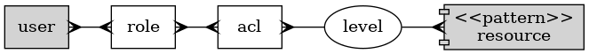

# SQLPage Authentication and Authorization Example

This is a very basic example of authentication and authorization boilerplate using [SQLPage](https://github.com/lovasoa/SQLpage/). I try to avoid verbose code and duplication as much as possible.

# Features

* Login Form
* Signup Form
* Protected pages
* Role based access (RBAC)
* Resource ACL

# Install

```bash
git clone https://github.com/mnesarco/sqlpage_auth_example.git
cd sqlpage_auth_example
docker compose up
```

After docker services are up and runnig, Go to http://localhost:8087

# Demo users

* **user** has basic access
* **user2** has manager access
* **admin** has full access

Password of all users is the same: `demo`

# Authorization concept

There are **users** and **resources** in the system. They are related through **roles** and access control lists (**ACL**)

roles can be granted or revoked from users. Each role has a level access to a resource pattern.



You can check if the current session (logged in user) has access to a specific resource with a certain authorization level:

```sql
-- Check if current user has access to products resource with a minimum level of 30

SELECT ...
WHERE x_resource_access(sqlpage.cookie('session'), 'products', level);

```

You can also check if a user has some role:

```sql
-- Check if current user has admin or manager roles

SELECT ...
WHERE x_role_access(sqlpage.cookie('session'), 'admin', 'manager');

```

# Disclaimer

This is an example of a possible solution using the existing version of [SQLPage=0.17.1](https://github.com/lovasoa/SQLpage/)  Use at your own risk.